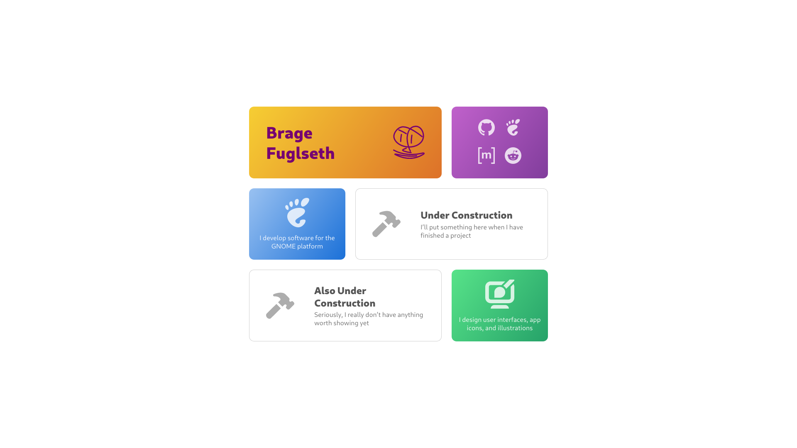

# bragefuglseth.dev

This is my personal website, where I tell a little about myself, showcase my
projects, and provide contact links. It has a contemporary and modular grid
design that scales across device sizes. The site is written in pure HTML and
CSS, and does not contain any JS at all.

## Usage

Feel free to use this as a starting point for your own page. The code should be
pretty self-explanatory, just replace my content with your own.

- If you want to link to other social platforms, you can find their logos on the
internet (preferably in SVG format, so you can recolor it easily if it isn't
white already).

- You can add more cards. The website will scale accordingly. Try to alternate
between pairs of cards with the `card-square` class and pairs of cards with the
`card-wide` class for a more varied design.

- The site uses the [Cantarell typeface](https://cantarell.gnome.org). If you
want to use something else, just replace it.
